  

## 📌 About Me
- Computer Science student passionate about software development and problem solving.
- Skilled in Java and Python programming.
- Interested in Artificial Intelligence, automation systems, and backend development.

## 📊 GitHub Stats & Trophies

  
  

  

## 🛠️ Languages & Tools

<h3 align="center">Programming Languages</h3>

  &nbsp;&nbsp;&nbsp;&nbsp;&nbsp;&nbsp;&nbsp;&nbsp;&nbsp;&nbsp;&nbsp;&nbsp;
  

<h3 align="center">Frontend</h3>

  

<h3 align="center">Backend</h3>

  

<h3 align="center">DevOps & Cloud</h3>

  

  

 

## 🔗 Connect with Me

  

<picture>
  <source media="(prefers-color-scheme: dark)" srcset="https://raw.githubusercontent.com/abozanona/abozanona/output/pacman-contribution-graph-dark.svg">
  <source media="(prefers-color-scheme: light)" srcset="https://raw.githubusercontent.com/abozanona/abozanona/output/pacman-contribution-graph.svg">
  
</picture>

